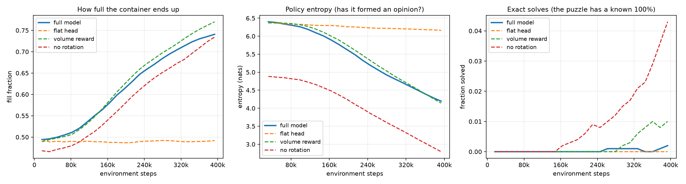

<p align="center">
  <picture>
    <source media="(prefers-color-scheme: dark)" srcset="https://github.com/user-attachments/assets/cc6b56b7-b68f-46f3-822a-354a00e52c40">
    
  </picture>
</p>

# stowage: a packing puzzle

A reinforcement learning agent that packs 3D boxes into a container, and a browser game where you can watch it, play the same puzzle yourself, or race it.

**Live demo:** [stowage.com](https://stowage-627911504151.us-central1.run.app/)

https://github.com/user-attachments/assets/b17624d1-848e-440f-879e-0f4a470bb3b6

Every puzzle is made by cutting a container into pieces, so a **perfect 100% packing always exists**.

## Results

200 puzzles, agent and baseline given identical box sets.

| | fill |
|---|---|
| Random legal moves | 52.0% |
| Greedy heuristic | 83.6% |
| **Agent, single pass** | **84.9%** |
| **Agent, best of 16** | **90.3%** |
| Perfect packing | 100% |

On a single pass it beats the greedy heuristic by **+2.06 points** (t = 6.9, winning 66% of individual puzzles). The reason shows up in the waste: it traps **2.6%** of the container as dead air, against greedy's 6.7%.

## What actually made it work



Each curve is the same training run with exactly one thing changed, over 400k steps.

**The network architecture was the whole ballgame.** The orange line is a standard MLP ending in one big output layer — it has to learn 25,920 unrelated scores, and "box 3 at (4,5)" tells it nothing about "box 3 at (4,6)". It never gets off the floor, and the middle panel shows why: its policy entropy barely moves, meaning it never forms an opinion about anything. Replacing that head with a dot product between box descriptions and spot descriptions is what made the problem learnable at all.

**Rotation trades fill for exact solves.** Dropping it shrinks the action space, so the red line solves more puzzles outright while filling slightly less on average.

## Run it

```bash
pip install -r requirements.txt
python backend/app.py      # then open http://127.0.0.1:8000
```

A trained model ships with the repo, so this works without training anything. There's a `Dockerfile` for deploying it — that's what the live demo runs on.

**Watch** the bot pack puzzle after puzzle · **Play** one yourself (click a box, `R` turns it, click to drop, `U` undoes) · **Compete** for the same pieces on a split screen, first to a perfect pack wins.

To train from scratch — about four hours on a CPU:

```bash
pip install -r requirements-train.txt
python backend/train.py --randomize --box-source perfect --grid-min 8 --grid-size 12 --timesteps 4000000
```

## How it works

A move is three choices at once: which box, which way up, and where to drop it — 25,920 options per turn, nearly all illegal. The environment masks it down to the legal ones.

Rather than learn 25,920 unrelated scores, the network learns to *describe a box* and to *describe a spot*, then scores a pair by how well the two match. What it learns about one spot carries to similar ones, which is what makes it trainable. A placement is rewarded with the space it gains: the box's volume minus the dead air it seals underneath.

At play time it can take one pass, sample several attempts and keep the best, or run a beam search that carries several part-finished packings and drops the poor ones.

## Files

```
backend/     the RL system and the server
frontend/    the game itself
model/       the trained policy that ships with the repo
```

**`backend/`**

| | |
|---|---|
| `environment.py` | the game: container, boxes, rules, reward, legal moves |
| `policy.py` | the network |
| `solver.py` | playing a puzzle: single pass, sampling, beam search |
| `baseline.py` | the greedy heuristic to beat |
| `model_loader.py` | finds the trained policy |
| `paths.py` | where everything lives, anchored to the repo root |
| `app.py` | FastAPI server — builds puzzles, runs the policy |
| `train.py` | training |
| `plot_ablations.py` | draws the figure above from the training logs |
| `check_js.py` | rough syntax check for the front end's inline JS |
| `export_run.py` | writes the runs `viewer.html` replays |

**`frontend/`**

| | |
|---|---|
| `app.html` | the whole game: three.js scene, all three modes |
| `viewer.html` | standalone replay page, needs no server |

**Root**

| | |
|---|---|
| `Dockerfile` | CPU-only image; this is what the live demo runs |
| `run_graph.ps1` | runs the ablation arms behind the figure |

## Limitations

- **Boxes only drop straight down** — they can't slide into a gap under an overhang. Costs about 5.7 points of fill.
- **Sizes are capped** at 6-12 per side and 30 boxes; the network's input is a fixed size.
- **It rarely finds the perfect answer** — 97% of 3-4 piece puzzles, ~60% at 5-8, essentially never above 17. Exact 3D packing is NP-hard.

## References

Three papers shaped the implementation:

- Yin, H., He, H., Chen, F. **Deep Reinforcement Learning for Scalable Offline Three-Dimensional Packing.** AAAI 2026. — where the dot-product scoring comes from: describe each item and each space, then score every pair by how well the two match, and multiply by a feasibility mask. Also the reward shape, `r_t = g_{t-1} − g_t` over wasted space. [code](https://github.com/Ashenone511/BBMP-DCS)
- Xiong, H., Guo, C., Peng, J., Ding, K., Chen, W., Qiu, X., Bai, L., Xu, J. **GOPT: Generalizable Online 3D Bin Packing via Transformer-Based Deep Reinforcement Learning.** IEEE RA-L 9(11), 2024. — a single masked actor-critic trained with PPO, and the Empty Maximal Space idea for shrinking the action space. [code](https://github.com/Xiong5Heng/GOPT)
- Wang, B., Lin, Z., Kong, W., Dong, H. **Bin Packing Optimization via Deep Reinforcement Learning.** IEEE RA-L 10(3), 2025. — the height-map placement model used here: a box falls straight down and rests on whatever is beneath it.
